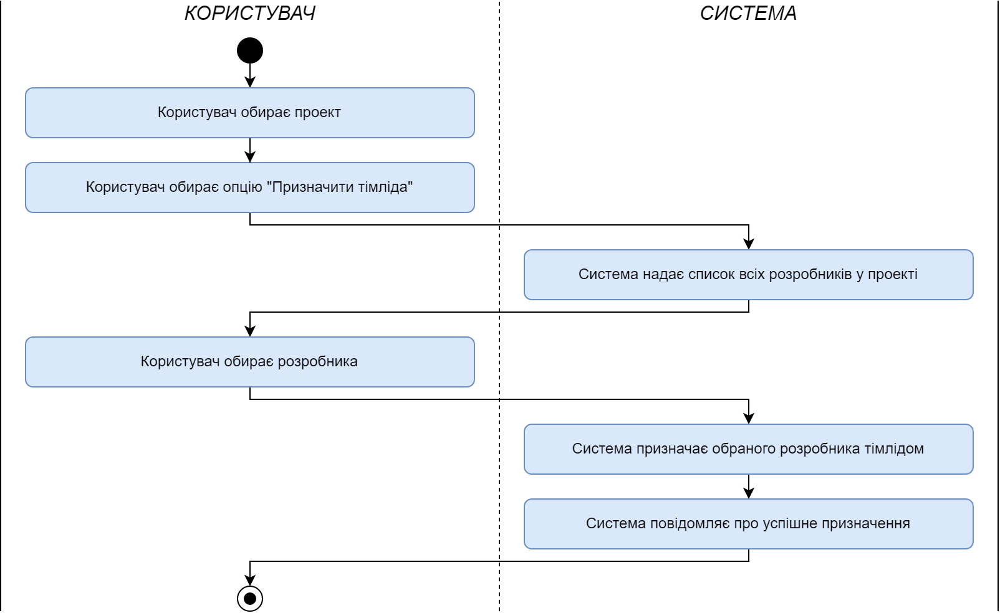

## Діаграми прецедентів

**Загальна схема**

@startuml

  skinparam actorStyle awesome
  actor Користувач #f7f2f7
  usecase "Реєстрація" as Reg #b5d1ff
  usecase "Авторизація" as Auth #b5d1ff
  
  Користувач -u-> Auth
  Користувач -u-> Reg

  
  actor "Менеджер проектів" as Manager #ffebfd
  usecase "Керування \nпроектом" as ManageProj #b5ffc0

  Manager --> ManageProj
  
  
  actor Тімлід #ffebfd
  usecase "Керування станами \nпроекту" as ManageState #b5ffc0
  usecase "Керування \nзавданнями" as ManageTasks #b5ffc0

  Тімлід --> ManageState
  Тімлід --> ManageTasks
  
  
  actor Розробник #ffebfd
  usecase "Керування прикріпленнями \n(коментар + необов'язковий \nартефакт)" as EditAttachment #b5ffc0
  usecase "Переміщування завдань \nміж станами" as MoveTasks #b5ffc0

  Розробник --> EditAttachment
  Розробник --> MoveTasks
  
  
  Manager "<<extends>>".u.> Користувач
  Тімлід "<<extends>>".u.> Розробник
  Розробник "<<extends>>".u.> Користувач
  
@enduml

**Менеджер проектів (Project manager)**

@startuml

  skinparam actorStyle awesome
  actor "Менеджер проектів" as Manager #ffebfd
  usecase "Керування проектом" as ManageProj #b5ffc0
  
  Manager -d-> ManageProj
  
  usecase "Створення" as CreatePrj #b5d1ff
  usecase "Редагування" as EditPrj #b5d1ff
  usecase "Додавання розробників" as AddDevp #b5d1ff
  usecase "Призначення тімліда" as AddTL #b5d1ff
  usecase "Видалення" as DeletePrj #b5d1ff
  
  CreatePrj <-u- ManageProj
  EditPrj <-u- ManageProj
  AddDevp <-u- ManageProj
  AddTL <-u- ManageProj
  DeletePrj <-u- ManageProj

@enduml

**Розробник (Developer)**

@startuml

  skinparam actorStyle awesome
  actor Розробник #ffebfd
  usecase "Керування \nприкріпленнями" as EditPins #b5ffc0
  usecase "Переміщування завдань \nміж станами" as MoveTasks #b5ffc0

  Розробник -d-> EditPins
  
  usecase "Створення" as CreatePin #b5d1ff
  usecase "Редагування" as EditPin #b5d1ff
  usecase "Видалення" as DelPin #b5d1ff
  
  CreatePin <-u- EditPins
  EditPin <-u- EditPins
  DelPin <-u- EditPins
  
  Розробник -u-> MoveTasks
  
@enduml

**Тімлід (Teamlead)**

@startuml

  skinparam actorStyle awesome
  actor Тімлід #ffebfd
  usecase "Керування \nзавданнями" as EditTasks #b5ffc0
  usecase "Керування \nстанами проекту" as EditArt #b5ffc0

  Тімлід -u-> EditArt
  
  usecase "Створення" as CreatePlan #b5d1ff
  usecase "Редагування" as EditPlan #b5d1ff
  usecase "Видалення" as DeletePlan #b5d1ff
  
  CreatePlan <-d- EditArt
  EditPlan <-d- EditArt
  DeletePlan <-d- EditArt

  Тімлід --> EditTasks
  
  usecase "Створення" as CreateTask #b5d1ff
  usecase "Редагування" as EditTask #b5d1ff
  usecase "Призначення \nдедлайну" as AddDL #b5d1ff
  usecase "Призначення \nрозробника" as AddDevp #b5d1ff
  usecase "Переміщування \nміж станами" as MoveStan #b5d1ff
  usecase "Видалення" as DeleteTask #b5d1ff
  
  CreateTask <-u- EditTasks
  EditTask <-u- EditTasks
  AddDL <-u- EditTasks
  AddDevp <-u- EditTasks
  MoveStan <-u- EditTasks
  DeleteTask <-u- EditTasks

@enduml

## Сценарії використання

**ID: AUTH_01**

НАЗВА: Реєстрація в системі

УЧАСНИКИ: Користувач, Система

ПЕРЕДУМОВИ: 

+ Користувач не зареєстрований у системі

РЕЗУЛЬТАТ:

+ Реєстрація користувача в системі

ВИКЛЮЧНІ СИТУАЦІЇ:

+ AUTH_EX_01.01 Знайдено обліковий запис користувача у системі

ОСНОВНИЙ СЦЕНАРІЙ:

1. Користувач обирає опцію "Зареєструватися"
2. Система надає реєстраційну форму користувачеві
3. Користувач вводить дані для реєстрації
4. Користувач відправляє форму
5. Система перевіряє наявність облікового запису користувача (можлива AUTH_EX_01.01)
6. Система створює новий обліковий запис
7. Система надає дані облікового запису користувачеві

**ID: AUTH_02**

НАЗВА: Авторизація в системі

УЧАСНИКИ: Користувач, Система

ПЕРЕДУМОВИ:

+ Користувач не авторизований у системі
+ Користувач зареєстрований у системі

РЕЗУЛЬТАТ:

+ Авторизація користувача в системі

ВИКЛЮЧНІ СИТУАЦІЇ:

+ AUTH_EX_02.01 Користувач не пройшов авторизацію
+ AUTH_EX_02.02 Не знайдено обліковий запис користувача у системі

ОСНОВНИЙ СЦЕНАРІЙ:

1. Користувач обирає опцію "Авторизуватися"
2. Система надає авторизаційну форму користувачеві
3. Користувач вводить дані для авторизації
4. Користувач відправляє форму
5. Система перевіряє введені дані (можлива AUTH_EX_01.01)
6. Система перевіряє наявність облікового запису користувача (можлива AUTH_EX_01.02)
7. Система надає доступ користувачеві до облікового запису

**ID: PM_01**

НАЗВА: Створення проекту

УЧАСНИКИ: Менеджер проектів, Система

ПЕРЕДУМОВИ: Відсутні

РЕЗУЛЬТАТ:

+ Створення проекту

ВИКЛЮЧНІ СИТУАЦІЇ:

+ PM_EX_01.01 Некоректно задана інформація проекту

ОСНОВНИЙ СЦЕНАРІЙ:

1. Користувач обирає опцію "Створити проект"
2. Система надає форму створення проекту користувачеві
3. Користувач заповнює інформацію про проект
4. Користувач відправляє форму
5. Система перевіряє введені дані (можлива PM_EX_01.01)
6. Система створює новий проект
7. Система повідомляє про успішне створення

**ID: PM_02**

НАЗВА: Редагування проекту

УЧАСНИКИ: Менеджер проектів, Система

ПЕРЕДУМОВИ: 

+ Наявність проекту

РЕЗУЛЬТАТ:

+ Зміна інформації про проект

ВИКЛЮЧНІ СИТУАЦІЇ:

+ PM_EX_02.01 Некоректно задана інформація про проект

ОСНОВНИЙ СЦЕНАРІЙ:

1. Користувач обирає проект
2. Користувач обирає опцію "Редагувати"
3. Система надає форму редагування проекту
4. Користувач змінює інформацію про проект
5. Користувач відправляє форму
6. Система перевіряє введені дані (можлива PM_EX_02.01)
7. Система записує зміни
8. Система повідомляє про успішне редагування

**ID: PM_03**

НАЗВА: Додавання розробників

УЧАСНИКИ: Менеджер проектів, Система

ПЕРЕДУМОВИ: 

+ Наявність створених завдань

РЕЗУЛЬТАТ:

+ Додання розробників до проекту

ВИКЛЮЧНІ СИТУАЦІЇ:

+ PM_EX_03.01 Відсутність користувача в системі

ОСНОВНИЙ СЦЕНАРІЙ:

1. Користувач обирає проект
2. Користувач обирає опцію "Додати розробників"
3. Система надає форму додавання користувачеві
4. Користувач вводить імена користувачів
5. Користувач відправляє форму
6. Система перевіряє введені дані (можлива PM_EX_03.01)
7. Система додає розробників
8. Система повідомляє про успішне додання

**ID: PM_04**

НАЗВА: Призначення тімліда

УЧАСНИКИ: Менеджер проектів, Система

ПЕРЕДУМОВИ: 

+ Наявність проекту

РЕЗУЛЬТАТ:

+ Призначення тімліда до проекту

ВИКЛЮЧНІ СИТУАЦІЇ: Відсутні

ОСНОВНИЙ СЦЕНАРІЙ:

1. Користувач обирає проект
2. Користувач обирає опцію "Призначити тімліда"
3. Система надає список всіх розробників у проекті
4. Користувач обирає розробника
5. Система призначає обраного розробника тімлідом
6. Система повідомляє про успішне призначення

**ID: PM_05**

НАЗВА: Видалення проекту

УЧАСНИКИ: Менеджер проектів, Система

ПЕРЕДУМОВИ: 

+ Наявність проекту

РЕЗУЛЬТАТ:

+ Видалення проекту

ВИКЛЮЧНІ СИТУАЦІЇ: Відсутні

ОСНОВНИЙ СЦЕНАРІЙ:

1. Користувач обирає проект
2. Користувач обирає опцію "Видалити"
3. Система видаляє проект
4. Система повідомляє про успішне видалення

**ID: LEAD_01**
    
НАЗВА: Створення стану
    
УЧАСНИКИ: Тімлід, Система

ПЕРЕДУМОВИ: 

+ Наявність проекту

РЕЗУЛЬТАТ:

+ Створення нового стану в проекті

ВИКЛЮЧНІ СИТУАЦІЇ:

+ LEAD_EX_01.01 Назва стану зайнята

ОСНОВНИЙ СЦЕНАРІЙ:

1. Користувач обирає проект
2. Користувач обирає опцію "Додати стан"
3. Система надає форму додавання користувачеві
4. Користувач заповнює інформацію про стан
5. Користувач відправляє форму
6. Система перевіряє введені дані (можлива LEAD_EX_01.01)
7. Система додає новий стан у проект
8. Система повідомляє про успішне додання

**ID: LEAD_02**

НАЗВА: Редагування стану

УЧАСНИКИ: Тімлід, Система

ПЕРЕДУМОВИ: 

+ Наявність завдання
+ Наявність стану

РЕЗУЛЬТАТ:

+ Зміна інформації про стан

ВИКЛЮЧНІ СИТУАЦІЇ:

+ LEAD_EX_01.01

ОСНОВНИЙ СЦЕНАРІЙ:

1. Користувач обирає проект
2. Користувач обирає стан
3. Користувач обирає опцію "Редагувати"
4. Система надає форму редагування користувачеві
5. Користувач змінює інформацію про стан
6. Користувач відправляє форму
7. Система перевіряє введені дані (можлива LEAD_EX_01.01)
8. Система записує зміни
9. Система повідомляє про успішне редагування

**ID: LEAD_03**

НАЗВА: Видалення стану

УЧАСНИКИ: Тімлід, Система

ПЕРЕДУМОВИ: 

+ Наявність проекту
+ Наявність стану

РЕЗУЛЬТАТ:

+ Видалення стану

ВИКЛЮЧНІ СИТУАЦІЇ: Відсутні

ОСНОВНИЙ СЦЕНАРІЙ:

1. Користувач обирає проект
2. Користувач обирає стан
3. Користувач обирає опцію "Видалити"
4. Система видаляє стан
5. Система повідомляє про успішне видалення

**ID: LEAD_04**

НАЗВА: Створення завдання

УЧАСНИКИ: Тімлід, Система

ПЕРЕДУМОВИ: 

+ Наявність проекту
+ Наявність стану

РЕЗУЛЬТАТ:

+ Створення нового завдання

ВИКЛЮЧНІ СИТУАЦІЇ: Відсутні

ОСНОВНИЙ СЦЕНАРІЙ:

1. Користувач обирає проект
2. Користувач обирає стан
3. Користувач обирає опцію "Створити завдання"
4. Система надає форму створення користувачеві
5. Користувач заповняє інформацію про завдання
6. Користувач відправляє форму
7. Система створює завдання
8. Система повідомляє про успішне створення

**ID: LEAD_05**

НАЗВА: Редагування завдання

УЧАСНИКИ: Тімлід, Система

ПЕРЕДУМОВИ: 

+ Наявність проекту
+ Наявність стану
+ Наявність завдання

РЕЗУЛЬТАТ:

+ Зміна інформації про завдання

ВИКЛЮЧНІ СИТУАЦІЇ: Відсутні

ОСНОВНИЙ СЦЕНАРІЙ:

1. Користувач обирає проект
2. Користувач обирає стан
3. Користувач обирає завдання
4. Користувач обирає опцію "Редагувати"
5. Система надає форму редагування користувачеві
6. Користувач змінює інформацію про завдання
7. Користувач відправляє форму
8. Система записує зміни
9. Система повідомляє про успішне редагування

**ID: LEAD_06**

НАЗВА: Призначення дедлайну

УЧАСНИКИ: Тімлід, Система

ПЕРЕДУМОВИ: 

+ Наявність проекту
+ Наявність стану
+ Наявність завдання

РЕЗУЛЬТАТ:

+ Призначення дедлайну до завдання

ВИКЛЮЧНІ СИТУАЦІЇ:

+ LEAD_EX_06.01 Некоректний дедлайн

ОСНОВНИЙ СЦЕНАРІЙ:

1. Користувач обирає проект
2. Користувач обирає стан
3. Користувач обирає завдання
4. Користувач обирає опцію "Призначити дедлайн"
5. Система надає форму призначення користувачеві
6. Користувач обирає дедлайн
7. Користувач відправляє форму
8. Система перевіряє введені дані (можлива LEAD_EX_06.01)
9. Система призначає дедлайн
10. Система повідомляє про успішне призначення

**ID: LEAD_07**

НАЗВА: Призначення розробника

УЧАСНИКИ: Тімлід, Система

ПЕРЕДУМОВИ: 

+ Наявність проекту
+ Наявність стану
+ Наявність завдання
+ Наявність розробників
+ Відсутність розробника у завдання

РЕЗУЛЬТАТ:

+ Призначення розробника до завдання

ВИКЛЮЧНІ СИТУАЦІЇ: Відсутні

ОСНОВНИЙ СЦЕНАРІЙ:

1. Користувач обирає проект
2. Користувач обирає стан
3. Користувач обирає завдання
4. Користувач обирає опцію "Призначити розробника"
5. Система надає список всіх розробників у проекті
6. Користувач обирає розробника
7. Система призначає обраного розробника до завдання
8. Система повідомляє про успішне призначення

**ID: LEAD_08**

НАЗВА: Переміщення завдання між станами

УЧАСНИКИ: Тімлід, Система

ПЕРЕДУМОВИ: 

+ Наявність проекту
+ Наявність станів
+ Наявність завдання

РЕЗУЛЬТАТ:

+ Переміщення завдання до іншого стану

ВИКЛЮЧНІ СИТУАЦІЇ: Відсутні

ОСНОВНИЙ СЦЕНАРІЙ:

1. Користувач обирає проект
2. Користувач обирає стан
3. Користувач обирає завдання
4. Користувач обирає опцію "Змінити стан"
5. Система надає список усіх станів в проекті
6. Користувач обирає новий стан
7. Система переміщує завдання в обраний стан
8. Система повідомляє про успішне переміщення

**ID: LEAD_09**

НАЗВА: Видалення завдання

УЧАСНИКИ: Тімлід, Система

ПЕРЕДУМОВИ: 

+ Наявність проекту
+ Наявність стану
+ Наявність завдання

РЕЗУЛЬТАТ:

+ Видалення завдання

ВИКЛЮЧНІ СИТУАЦІЇ: Відсутні

ОСНОВНИЙ СЦЕНАРІЙ:

1. Користувач обирає проект
2. Користувач обирає стан
3. Користувач обирає завдання
4. Користувач обирає опцію "Видалити"
5. Система видаляє завдання
6. Система повідомляє про успішне видалення

**ID: DEV_01**

НАЗВА: Створення прикріплення

УЧАСНИКИ: Розробник, Система

ПЕРЕДУМОВИ: 

+ Наявність проекту
+ Наявність стану
+ Наявність завдання

РЕЗУЛЬТАТ:

+ Прикріплення додається до завдання

ВИКЛЮЧНІ СИТУАЦІЇ: Відсутні

ОСНОВНИЙ СЦЕНАРІЙ:

1. Користувач обирає проект
2. Користувач обирає стан
3. Користувач обирає завдання
4. Користувач обирає опцію "Прикріпити"
5. Система надає форму створення прикріплення користувачеві
6. Користувач заповняє інформацію про прикріплення
7. Користувач відправляє форму
8. Система додає прикріплення до завдання

**ID: DEV_02**

НАЗВА: Редагування прикріплення

УЧАСНИКИ: Розробник, Система

ПЕРЕДУМОВИ:

+ Наявність проекту
+ Наявність стану
+ Наявність завдання
+ Наявність прикріплення

РЕЗУЛЬТАТ:

+ Зміна інформації про прикріплення

ВИКЛЮЧНІ СИТУАЦІЇ: Відсутні

ОСНОВНИЙ СЦЕНАРІЙ:

1. Користувач обирає проект
2. Користувач обирає стан
3. Користувач обирає завдання
4. Користувач обирає прикріплення
5. Користувач обирає опцію "Редагувати"
6. Система надає форму редагування користувачеві
7. Користувач змінює інформацію про прикріплення
8. Користувач відправляє форму
9. Система записує зміни
10. Система повідомляє про успішне редагування

**ID: DEV_03**

НАЗВА: Видалення прикріплення

УЧАСНИКИ: Розробник, Система

ПЕРЕДУМОВИ:

+ Наявність проекту
+ Наявність стану
+ Наявність завдання
+ Наявність прикріплення

РЕЗУЛЬТАТ:

+ Видалення прикріплення

ВИКЛЮЧНІ СИТУАЦІЇ: Відсутні

ОСНОВНИЙ СЦЕНАРІЙ:

1. Користувач обирає проект
2. Користувач обирає стан
3. Користувач обирає завдання
4. Користувач обирає прикріплення
5. Користувач обирає опцію "Видалити"
6. Система видаляє прикріплення
7. Система повідомляє про успішне видалення

**ID: DEV_04**

НАЗВА: Переміщення завдання між станами

УЧАСНИКИ: Розробник, Система

ПЕРЕДУМОВИ:

+ Наявність проекту
+ Наявність станів
+ Наявність завдання

РЕЗУЛЬТАТ:

+ Переміщення завдання до іншого стану

ВИКЛЮЧНІ СИТУАЦІЇ: Відсутні

ОСНОВНИЙ СЦЕНАРІЙ:

1. Користувач обирає проект
2. Користувач обирає стан
3. Користувач обирає завдання
4. Користувач обирає опцію "Змінити стан"
5. Система надає список усіх станів в проекті
6. Користувач обирає новий стан
7. Система переміщує завдання в обраний стан
8. Система повідомляє про успішне переміщення

